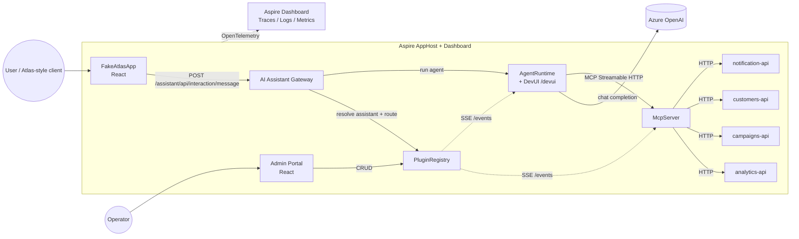

# agent-platform-lab

> **An operator-driven multi-agent AI platform on .NET 10.** Import any OpenAPI service, ship it as MCP tools, attach plugins to agents from a web UI, and route through a single gateway — no per-domain platform code. Built on .NET Aspire, Microsoft Agent Framework, Model Context Protocol, and OpenTelemetry.

This is a **reference architecture**: a working, runnable, end-to-end platform that an internal AI/platform team can use as a starter to onboard arbitrary standalone applications onto a shared AI gateway. The repo ships with one bundled standalone application (Marketing — analytics, campaigns, customers, notifications) as a demo, but **no platform-side code is specific to it**. The same loop onboards Fleet, HR, Field Ops, or any other domain.

---

## Why this exists

Most "agent demo" repos hard-code a single agent, single LLM, and a handful of in-process tools. That doesn't survive the jump to production where you have:

- Many standalone applications, each with its own backend services
- Operators (not engineers) curating which tools an agent can call
- A single client (Atlas, a copilot, a mobile app, a portal) that needs to hit *any* domain through a uniform contract
- Governance: who can call what, with what auth, audited, traced
- Hot-reload: shipping a new tool can't require a redeploy
- One trace per user interaction, end-to-end across every hop

This repo shows what the substrate looks like when those requirements drive the design.

## What you get in one `aspire run`

| Component                                  | Role                                                                                   |
| ------------------------------------------ | -------------------------------------------------------------------------------------- |
| **PluginRegistry**                         | CRUD store for API specs, plugins, agents, assistants. Source of truth, file-backed.   |
| **OpenAPI Importer**                       | Fetches `/openapi/v1.json` from any standalone-app API, persists the spec, idempotent. |
| **McpServer**                              | Hot-loads published plugins as MCP tools (HTTP Streamable transport). Subscribes to PluginRegistry events; reloads without a restart. |
| **AgentRuntime**                           | Hosts `AIAgent` instances built from agent definitions + attached plugin tools. Serves the Microsoft DevUI dashboard at `/devui`. |
| **AI Assistant Gateway**                   | Single public entry point — `POST /assistant/api/interaction/message`. Resolves an `assistantId` to an agent set, routes the prompt, aggregates the response with `routedTo` + `toolCalls` + `traceId`. |
| **Admin Portal** (React)                   | Operator UI for importing APIs, configuring plugins, attaching plugins to agents, and live-testing in both an HTTP playground and an LLM playground. |
| **FakeAtlasApp** (React)                   | Atlas-style demo client — exercises the production path (Gateway → routing → agent → tools). |
| **Marketing standalone app**               | Sample APIs: `analytics-api`, `campaigns-api`, `customers-api`, `notification-api`. Independent of the platform; they know nothing about agents or MCP. |
| **Aspire dashboard**                       | Service topology, console logs, metrics, **distributed traces across every hop**.      |

## Architecture at a glance



## The three killer demos

These are the moments worth showing in any platform-level conversation. Full walkthrough lives in [docs/end-to-end-test.md](docs/end-to-end-test.md).

### 1. OpenAPI → live MCP tools in under 60 seconds

In the Admin Portal:

- **APIs** → *Import* on `https://localhost:.../analytics-api/openapi/v1.json` (the discovery URL of any internal service)
- Pick operations, set tool names + descriptions, save → **Publish**
- The McpServer's SSE subscription picks up the `plugin.published` event and **hot-loads** the new tools into MCP. No restarts. No code changes.

This is the moment that lands. *"Any team that ships an OpenAPI service can be on the AI platform the same afternoon."*

### 2. AI Playground — test your tool description against an LLM before publishing

The platform makes a distinction every plugin author needs: an HTTP call working (right path, right params) is **not** the same as an LLM being able to invoke that call correctly given the tool description you wrote. The plugin detail page has two playgrounds side by side:

- **HTTP Playground** — direct call, tests path/params/auth
- **AI Playground** — single-turn LLM run with *only* this plugin's tools; shows you which tool the LLM picked, what arguments it parsed, and what came back. If the LLM didn't call any tool, you get an amber banner pointing you back at the description.

This shortens "ship a vague description → debug in production" to "ship a vague description → see it fail in the Admin Portal in 3 seconds → fix it before publish".

### 3. End-to-end distributed trace from Atlas to Azure OpenAI

Click the **traceId** badge under any reply in FakeAtlasApp. The Aspire dashboard renders the full span tree across every service:

```
AssistantInteraction               [Gateway]
  AssistantRegistry.Resolve
  AgentRouter.Resolve
  AgentRuntime.Execute              [Gateway → Runtime]
    AIAgent.Run                     [Runtime]
      chat.completions              [Azure OpenAI]
      mcp.callTool get_open_rate    [Runtime → MCP]
        HTTP GET /analytics/...     [MCP → analytics-api]
      chat.completions              [Azure OpenAI]  ← continuation after tool result
```

Each span carries `gen_ai.system`, `gen_ai.request.model`, `gen_ai.usage.input_tokens`, `mcp.method.name`, `plugin.name`, `agent.name`, `agent.router_reason`, `tool_calls.count`. Zero application code wrote any of this — it's all from the shared `ServiceDefaults` and the agent observability sources.

## Repository layout

```
src/
 ├── BuildingBlocks/
 │   ├── MarketingAnalyticsAgentLab.ServiceDefaults/   Aspire defaults, OTel, agent observability
 │   └── MarketingAnalyticsAgentLab.Shared/             DTOs + extensibility seams
 ├── Platform/                                          ←── THIS is the platform
 │   ├── MarketingAnalyticsAgentLab.AppHost/            Aspire orchestrator
 │   ├── MarketingAnalyticsAgentLab.PluginRegistry/     CRUD + OpenAPI importer + events
 │   ├── MarketingAnalyticsAgentLab.McpServer/          Dynamic MCP tool host
 │   ├── MarketingAnalyticsAgentLab.AgentRuntime/       AIAgent host + DevUI + AI playground
 │   ├── MarketingAnalyticsAgentLab.AiAssistantGateway/ Single Atlas-facing entry point
 │   └── MarketingAnalyticsAgentLab.AdminPortal/        React operator UI
 ├── Clients/
 │   └── MarketingAnalyticsAgentLab.FakeAtlasApp/       React demo client
 └── StandaloneApps/                                    ←── sample apps (the Marketing one ships)
     └── Marketing/
         ├── MarketingAnalyticsAgentLab.MarketingAnalytics.Api/
         ├── MarketingAnalyticsAgentLab.CampaignManagement.Api/
         ├── MarketingAnalyticsAgentLab.CustomerInsights.Api/
         └── MarketingAnalyticsAgentLab.Notification.Api/
docs/
 ├── architecture.md                                    Layered design + sequence diagrams
 ├── end-to-end-test.md                                 The 10-step demo script (Steps 1-11)
 └── prompts.md                                         Curated test prompts
Directory.Build.props / Directory.Packages.props        Central Package Management - every version pinned
global.json                                             Pins .NET 10
nuget.config                                            Forces nuget.org
```

> **Naming note.** The C# root namespace is currently `MarketingAnalyticsAgentLab.*` for historical reasons (the platform started as a marketing-focused POC). The platform code is fully generic — only `src/StandaloneApps/Marketing/` is marketing-domain. Renaming the namespace is a mechanical search-and-replace that can be done as a separate PR; the repo name (`agent-platform-lab`) is the canonical platform name going forward.

## Tech stack (every version pinned in `Directory.Packages.props`)

| Component                       | Version              |
| ------------------------------- | -------------------- |
| .NET SDK target                 | net10.0              |
| .NET Aspire                     | 13.3.2               |
| Microsoft Agent Framework       | 1.6.1                |
| `Microsoft.Agents.AI.DevUI`     | 1.6.1-preview        |
| `Microsoft.Agents.AI.Workflows` | 1.6.1                |
| Microsoft.Extensions.AI         | 10.6.0               |
| Model Context Protocol C# SDK   | 1.3.0                |
| Azure.AI.OpenAI                 | 2.1.0                |
| OpenTelemetry                   | 1.15.x               |
| Scalar.AspNetCore               | 2.14.x               |
| React                           | 19.x                 |
| Vite                            | 6.x                  |
| TypeScript                      | 5.7                  |
| Tailwind CSS                    | 3.4                  |

## Quick start

### Prerequisites

- **.NET 10 SDK** (10.0.103 or later). Check with `dotnet --list-sdks`.
- **Node.js 22 LTS** and **npm 11**. Check with `node --version`.
- **Azure OpenAI** resource with a deployed chat model (e.g. `gpt-4o-mini`). Either an API key or `az login` with the `Cognitive Services OpenAI User` role works.
- **Visual Studio 2026** (or `dotnet run` from CLI). Both work; VS handles the AppHost lifecycle nicely.

### Run

```pwsh
# 1. Restore + build everything to confirm the toolchain
dotnet build MarketingAnalyticsAgentLab.slnx

# 2. Install web dependencies (one time, per Admin Portal + FakeAtlasApp)
pushd src\Platform\MarketingAnalyticsAgentLab.AdminPortal; npm install; popd
pushd src\Clients\MarketingAnalyticsAgentLab.FakeAtlasApp; npm install; popd

# 3. Configure Azure OpenAI on the AppHost (stored in user-secrets, NOT in source)
dotnet user-secrets --project src\Platform\MarketingAnalyticsAgentLab.AppHost set Parameters:AzureOpenAIEndpoint   "https://<your-resource>.openai.azure.com"
dotnet user-secrets --project src\Platform\MarketingAnalyticsAgentLab.AppHost set Parameters:AzureOpenAIKey        "<your-key>"
dotnet user-secrets --project src\Platform\MarketingAnalyticsAgentLab.AppHost set Parameters:AzureOpenAIDeployment "gpt-4o-mini"

# 4. Launch the entire platform
dotnet run --project src\Platform\MarketingAnalyticsAgentLab.AppHost
```

The Aspire dashboard URL is printed on startup (e.g. `https://localhost:17100`). Open it, wait for every resource to report **Running**, then:

- **Admin Portal** → import APIs, configure plugins, attach to agents → follow [docs/end-to-end-test.md](docs/end-to-end-test.md)
- **agent-runtime → /devui** → chat with any agent, see Events / Tools / token usage
- **FakeAtlasApp** → simulate the Atlas integration
- **Aspire dashboard → Traces** → end-to-end span tree for every interaction

## Onboarding a second standalone application

The whole point of the platform is that this takes minutes. The pattern:

1. Add the new application's APIs under `src/StandaloneApps/<NewApp>/`. They're plain ASP.NET Core projects with OpenAPI enabled at `/openapi/v1.json` — they know nothing about the platform.
2. Reference them from `AppHost.cs` exactly like the Marketing APIs.
3. In the Admin Portal → **APIs** → *Import* against each one's `/openapi/v1.json`.
4. Compose **plugins** by selecting operations across the imported APIs. Configure tool name + tool description. Publish.
5. Either reuse an existing agent or create a new one in **Agents** → *Create*. Attach the new plugins. Click **Reload AgentRuntime**.
6. Either reuse the `marketing_analytics_assistant` or create a new assistant in **Assistants** → bind to the new agent set.
7. Point FakeAtlasApp (or your real client) at the new assistant ID. Done.

The seeded `fleet_pro_assistant` (in [`SeedDataLoader.cs`](src/Platform/MarketingAnalyticsAgentLab.PluginRegistry/Seeding/SeedDataLoader.cs)) is a disabled stub specifically to demonstrate this point — onboarding "Fleet" is purely configuration through the Admin Portal.

## Designed-in safety properties

The platform encodes a few opinions worth calling out in any review:

- **No agent runs with an empty tool set.** [`AgentLifecycleService.BuildAgent`](src/Platform/MarketingAnalyticsAgentLab.AgentRuntime/Agents/AgentLifecycleService.cs) detects the zero-tools state and injects a hard guardrail into the system prompt that forces the agent to surface the misconfiguration to the user instead of hallucinating. Prevents the #1 failure mode of operator-driven platforms.
- **Self-healing plugin → spec references.** When `data/api-specs/` is reset between sessions, plugins that previously pointed at deleted specs are detected and re-linked by matching operation IDs against any imported spec ([`PluginEndpoints.ResolveSpecAsync`](src/Platform/MarketingAnalyticsAgentLab.PluginRegistry/Endpoints/PluginEndpoints.cs)).
- **404-tolerant registry clients.** Both `McpServer` and `AgentRuntime` treat a missing api-spec as a skip-and-log, not a crash. One orphaned plugin can't take down the whole tool set.
- **Startup race resilience.** `AgentLifecycleService.PrimeAsync` retries `RebuildAsync` with backoff when MCP is up but its background tool load hasn't completed yet (Aspire's `WaitFor` only waits for the listener, not the background work).
- **`dryRun` guardrail in optimisation prompts.** The seeded `CampaignOptimizationAgent` system prompt forbids `send_campaign(dryRun=false)` unless the user explicitly says "send it now". Demonstrates how operator-authored instructions encode write-protection.
- **Diagnostic endpoint** `GET /agents/diagnostics/mcp` on AgentRuntime — surfaces the exact MCP client failure mode if anything ever looks off, instead of swallowing it as a `LogWarning`.

## Documentation

- [docs/architecture.md](docs/architecture.md) — Layered architecture, sequence diagrams, extensibility seams, future directions.
- [docs/end-to-end-test.md](docs/end-to-end-test.md) — 11-step walkthrough from "fresh `aspire run`" to "tools hot-reloading mid-conversation". This is the demo script.
- [docs/prompts.md](docs/prompts.md) — Curated test prompts organised by what each one exercises.

## Roadmap / what's deliberately out of scope today

The repo is positioned as a **reference architecture and POC**, not a hardened product. Concrete next steps a real platform team would add on top:

- **AuthN/AuthZ** — `Microsoft.AspNetCore.Authentication.JwtBearer` is already in CPM. Each service is a single `.AddJwtBearer()` call away.
- **Multi-tenant** — `ITenantContext` is a placeholder interface in [`MarketingAnalyticsAgentLab.Shared`](src/BuildingBlocks/MarketingAnalyticsAgentLab.Shared/Abstractions/ITenantContext.cs). Swap the default impl for a JWT-claim-driven one.
- **Persistent workflow state** — `IWorkflowStore` is a placeholder; today everything is in-memory. The `Microsoft.Agents.AI.Workflows` package supports checkpointing — wire `InProcessExecution.WithCheckpointing(...)`.
- **Plugin policies** — `PluginPolicyEvaluator` currently always-allows. Drop in OPA / a custom evaluator.
- **Production data store** — `FileSystemPluginStore` is intentionally trivial. Swap for SQL/Cosmos.
- **Rate limiting + cost controls** at the Gateway layer.
- **Namespace rename** from `MarketingAnalyticsAgentLab.*` → `AgentPlatform.*` (or your codename of choice). Mechanical search-and-replace; deliberately not done so the demo content stays coherent.

## License

MIT.
