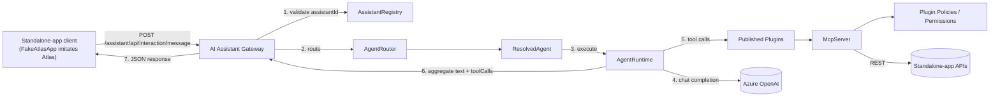
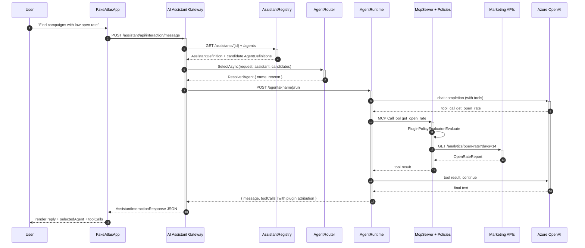
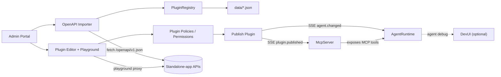
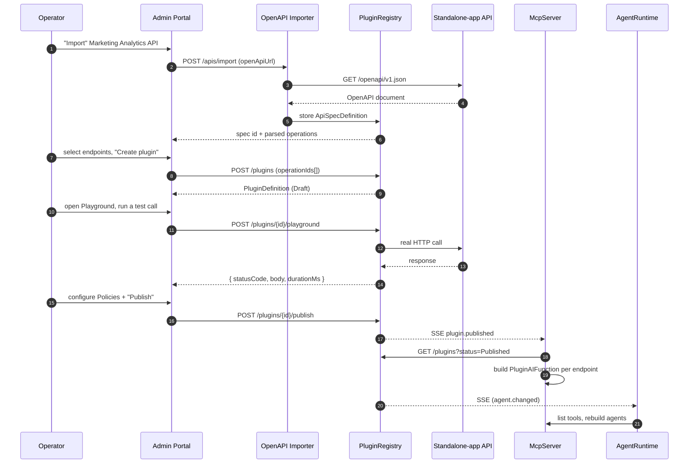

# Architecture - Marketing Analytics Agent Lab

This document describes the **Marketing Analytics Agent Lab** platform from an architecture-review perspective: what each component is for, how they are wired together, and where the platform deliberately leaves seams open for future work.

The project is positioned as **API Management + AI Gateway + Agent Platform** for standalone applications, not a chatbot sample.

---

## 1. Platform principle

> **Standalone application teams should not need to change their services to become agentic. If a standalone application exposes OpenAPI, the platform can import it, transform selected endpoints into plugins/tools, and make them available for AI agents through the centralized AI Assistant Gateway.**

Every component in this document is in service of that principle:

- The **AI Assistant Gateway** is the single integration point standalone-app clients (Atlas-style) call.
- The **OpenAPI Importer** and **PluginRegistry** turn ordinary REST APIs into plugin tools without touching the underlying service.
- The **McpServer** loads those plugins dynamically and exposes them through MCP, the same fabric agents already speak.
- The **AgentRuntime** composes them into Microsoft Agent Framework agents the Gateway can invoke.

Marketing is the first standalone app wired end to end. Fleet exists as a disabled assistant stub to demonstrate the platform's multi-app shape.

---

## 2. Source-tree separation

The folder structure mirrors the architecture:

```
src/
 ├── BuildingBlocks/   shared infrastructure consumed by everything
 ├── Platform/         reusable AI Assistant Gateway platform
 ├── StandaloneApps/   one folder per onboarded standalone application
 │    └── Marketing/   (future siblings: Fleet/, Billing/, CRM/, ...)
 └── Clients/          demo clients only (FakeAtlasApp)
```

A standalone application never references anything under `Platform/`. The platform never references anything under `StandaloneApps/`. The only link between them is the OpenAPI document the standalone application exposes, which the OpenAPI Importer brings into the Plugin Registry.

## 3. Components at a glance

| Folder | Component | Responsibility |
| --- | --- | --- |
| `Platform/` | **AI Assistant Gateway** (`MarketingAnalyticsAgentLab.AiAssistantGateway`) | Single public endpoint. Validates assistantId, routes, executes, aggregates, returns. Emits explicit OpenTelemetry spans (`AssistantInteraction`, `AssistantRegistry.Resolve`, `AgentRouter.Resolve`, `AgentRuntime.Execute`). |
| `Platform/` | **AssistantRegistry** (`IAssistantRegistry` + Plugin Registry service) | Platform registry of `AssistantDefinition`s. One per standalone app. |
| `Platform/` | **AgentRouter** (`IAgentRouter`) | Resolves one agent out of the assistant's pool per request. |
| `Platform/` | **AgentRuntime** (`MarketingAnalyticsAgentLab.AgentRuntime`) | Hosts live `AIAgent` instances. Hot-rebuilds on registry events. Also hosts the in-process Microsoft Agent Framework **DevUI** at `/devui` in Development. |
| `Platform/` | **OpenAPI Importer** (`MarketingAnalyticsAgentLab.PluginRegistry`) | Pulls OpenAPI specs from standalone-app discovery URLs. |
| `Platform/` | **PluginRegistry** (`MarketingAnalyticsAgentLab.PluginRegistry`) | CRUD for ApiSpec / Plugin / Agent / Assistant definitions + Playground proxy + SSE event stream. |
| `Platform/` | **Plugin Policies / Permissions** (`PluginPolicyEvaluator`) | Platform policy boundary on every tool invocation. |
| `Platform/` | **McpServer** (`MarketingAnalyticsAgentLab.McpServer`) | Dynamic plugin -> MCP tool host. Subscribes to PluginRegistry events. |
| `Platform/` | **Admin Portal** (`MarketingAnalyticsAgentLab.AdminPortal`) | Onboarding UI for the authoring pipeline. Lightweight metadata management - **not** a workflow designer. |
| `Platform/` | **DevUI** (`Microsoft.Agents.AI.DevUI`) | Microsoft Agent Framework dashboard hosted in-process by AgentRuntime at `/devui`. Workflow visualization, trace inspection, orchestration debugging. Not on the runtime path. |
| `Platform/` | **AppHost** (`MarketingAnalyticsAgentLab.AppHost`) | Aspire-managed local topology with `WithReference` / `WaitFor`. |
| `Clients/` | **FakeAtlasApp** (`MarketingAnalyticsAgentLab.FakeAtlasApp`) | Lightweight Atlas simulator. Calls only the Gateway. |
| `StandaloneApps/Marketing/` | `MarketingAnalytics.Api`, `CampaignManagement.Api`, `CustomerInsights.Api`, `Notification.Api` | Normal REST APIs. Know nothing about the platform. |
| `BuildingBlocks/` | `MarketingAnalyticsAgentLab.ServiceDefaults` | OpenTelemetry, service discovery, agent observability sources. |
| `BuildingBlocks/` | `MarketingAnalyticsAgentLab.Shared` | Contracts and abstractions used across every service. |

---

## 4. Runtime flow

`POST /assistant/api/interaction/message` is the only public entry path. The Gateway runs routing **before** runtime execution so the AgentRuntime never has to know about routing policy.



End-to-end sequence for a single interaction:



The Gateway's response contract is fixed:

```json
{
  "conversationId": "...",
  "assistantId": "...",
  "selectedAgent": "<resolved agent name>",
  "message": "...",
  "toolCalls": [{ "plugin": "...", "tool": "..." }],
  "routerReason": "...",
  "traceId": "..."
}
```

---

## 5. Authoring flow (OpenAPI -> live agent capability)



Step-by-step:



The dotted line to **DevUI** in the flow diagram is intentional: DevUI is an **optional development / debugging experience**. The primary runtime entry point remains `POST /assistant/api/interaction/message`.

---

## 6. Plugin transformation model

Every published plugin is a `PluginDefinition` with one or more `PluginEndpoint`s. Each endpoint becomes one MCP tool. The McpServer translates a tool invocation into an HTTP request against the original standalone-app API:

- **Path** parameters substitute `{name}` placeholders.
- **Query** parameters are appended.
- **Header** parameters are added to the request.
- **Body** parameters become the JSON request body.
- The plugin's `PluginAuthConfig` injects bearer / api-key headers using env-var-named secrets.

The standalone-app API never sees anything different from a normal HTTP client.

Plugin attribution flows back to the caller: when AgentRuntime captures `FunctionCallContent` / `FunctionResultContent` from the Agent Framework stream, it joins each tool call to its source plugin (using a `tool -> plugin` map built when the agent was composed). The Gateway forwards that array verbatim:

```json
"toolCalls": [
  { "plugin": "CampaignManagementPlugin", "tool": "get_campaigns" },
  { "plugin": "MarketingAnalyticsPlugin", "tool": "get_open_rate" }
]
```

---

## 7. Plugin Policies / Permissions

Every plugin invocation passes through `PluginPolicyEvaluator` inside the McpServer. This is the platform's seam for:

- per-tenant allow lists
- per-agent allow lists
- "requires approval" workflows that gate the call behind a human reviewer

Today's evaluator is intentionally always-allow but logs every decision so the OpenTelemetry trace shows the boundary. The decision is taken inside the McpServer rather than the AgentRuntime so the same policy applies to every agent regardless of which runtime invoked it.

---

## 8. Service discovery & resilience

Every downstream call uses the **Aspire service-discovery scheme** `https+http://<service-name>`. The Aspire AppHost injects environment variables of the form `services__<name>__https__0` and `services__<name>__http__0` into each consuming process, and the resilience handler resolves the symbolic URI at request time. There are **no hard-coded ports** in application code.

The React apps (Admin Portal + FakeAtlasApp) consume the same env vars (re-exposed by Vite via `envPrefix: ['VITE_', 'services__']`) so they find the gateway / registry / runtime at runtime.

---

## 9. Observability

The platform is built on Microsoft's "golden triangle" pattern: **Microsoft Agent Framework + DevUI + OpenTelemetry**. Traces flow into two viewers simultaneously:

- **Aspire dashboard** - the end-to-end view across every service.
- **Agent Framework DevUI** (in-process at `/devui` in AgentRuntime) - the agent-centric view, focused on individual agent runs, workflow steps, and tool calls.

Every service calls `builder.AddServiceDefaults()` which configures OpenTelemetry traces + metrics + logs, AspNetCore + HttpClient + Runtime instrumentation, and forwards everything via OTLP. The platform registers a single shared `ActivitySource` named **`MarketingAnalyticsAgentLab`** (defined in [`Extensions.PlatformActivitySource`](src/BuildingBlocks/MarketingAnalyticsAgentLab.ServiceDefaults/Extensions.cs)) so all platform-emitted spans are discoverable under one source name.

Agent-hosting services (`McpServer`, `AgentRuntime`) additionally call `builder.AddAgentObservability()` to add the `Microsoft.Agents.AI`, `Microsoft.Agents.AI.Workflows`, `Microsoft.Extensions.AI`, `Experimental.Microsoft.Extensions.AI`, and `ModelContextProtocol` OpenTelemetry sources. Every chat completion, every policy evaluation, every tool call, every workflow step appears as a span.

The Gateway emits explicit named spans for each pipeline stage so traces are easy to read:

| Span | Kind | Key tags |
| --- | --- | --- |
| `AssistantInteraction` | server | `assistant.id`, `assistant.tenant_id`, `conversation.id`, `assistant.application`, `agent.name` |
| `AssistantRegistry.Resolve` | client | (parent of above) |
| `AgentRouter.Resolve` | internal | `agent.name`, `agent.router_reason` |
| `AgentRuntime.Execute` | client | `agent.name`, `tool_calls.count` |

The Gateway also sets `traceId` on every `AssistantInteractionResponse` from `Activity.Current?.Id`, so FakeAtlasApp can render it inline and operators can pivot from a UI reply directly to the matching trace in either viewer.

---

## 10. Extensibility seams

The platform exposes a small set of interfaces in `MarketingAnalyticsAgentLab.Shared` that pre-define where the natural extension points live:

| Interface | What it unlocks |
| --- | --- |
| `IPluginRegistryStore` | Swap file storage for a database; partition by tenant; add audit logs. |
| `IAgentDefinitionStore` | Same, for agent definitions. |
| `IAssistantRegistry` | Same, for assistant definitions; control which assistants exist per environment. |
| `IAgentRouter` | Plug in an LLM-based router, a feature-flag-driven router, or A/B routing. |
| `IMcpToolRegistry` | Custom reporting / governance views over the live MCP tool set. |
| `IAgentRegistry` | Build alternate runtime hosts that publish agents to the platform with the same shape. |
| `IApiCatalog` | Wire to a real service registry (k8s, Consul, ...) instead of in-memory state. |
| `ITenantContext` | JWT-claim / subdomain / header-based tenant resolution. |
| `IWorkflowStore` | Workflow checkpointing / persistence for multi-step agent workflows. |
| `PluginPolicyEvaluator` | Tenant / agent / approval gates on every tool invocation. |

---

## 11. Reusing the platform for another standalone app

To onboard a second standalone application (say Fleet):

1. The Fleet team keeps shipping their normal REST API. No code changes required.
2. Drop the Fleet projects into a new folder `src/StandaloneApps/Fleet/` and reference them from the AppHost. The folder structure naturally extends - no platform changes.
3. An operator opens the Admin Portal, imports Fleet's OpenAPI document, picks the operations they want to expose, and configures the resulting plugin.
4. The operator creates `AgentDefinition`s that wire those plugins into Microsoft Agent Framework agents.
5. The operator enables the `fleet_pro_assistant` `AssistantDefinition`, listing the agents it should route between.
6. Atlas already knows the integration contract - it just sends a request with `assistantId: "fleet_pro_assistant"` to the same `/assistant/api/interaction/message` URL.

No gateway code changes, no runtime code changes, no new endpoints. The same `Platform/` folder serves Marketing, Fleet, and any future standalone app.

---

## 12. Future directions

- **Streaming the main endpoint** - keep the JSON path as default but honour `Accept: text/event-stream` on the same URL to proxy AgentRuntime's existing SSE.
- **Multi-agent workflows** - expose the existing workflow seam as a routable "virtual agent" so the Router can pick a multi-step workflow per request. DevUI already visualizes Agent Framework workflows.
- **Plugin marketplace** - publish plugins from many standalone-app teams to a central catalog with versioning and rollouts.
- **AuthN/AuthZ on the gateway** - validate JWTs on the public endpoint, resolve `tenantId` from claims rather than the request body, propagate to the policy evaluator.
- **Dynamic DevUI agent discovery** - the current preview `Microsoft.Agents.AI.DevUI` package requires agents to be registered at host-build time. Once Microsoft adds runtime registration, the AgentRuntime can stream the live `RuntimeAgentRegistry` set into DevUI without an AgentRuntime restart.
- **AG-UI for end-user surfaces** - Microsoft's "golden triangle" pairs DevUI (developers) with AG-UI (end-users). The platform is well placed to add an AG-UI host alongside FakeAtlasApp once the .NET AG-UI package stabilises.
